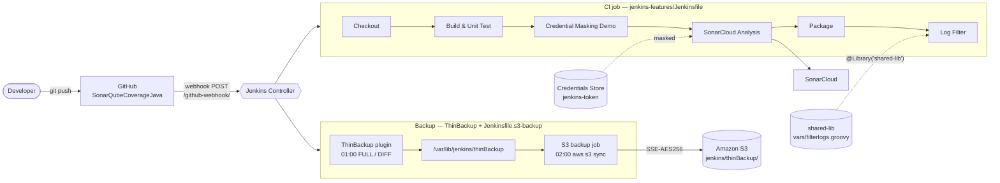

# Jenkins CI/CD Features — Log Filtering, Credential Masking, ThinBackup to S3 & GitHub Webhooks


This project shows four production Jenkins features working together on one Java/Maven application, [SonarQubeCoverageJava](https://github.com/zestabhijeet/SonarQubeCoverageJava):

| # | Feature | What it solves | Implemented with |
|---|---|---|---|
| 1 | **Log filtering** | Flags builds that are noisy with warnings without failing them | `filterlogs()` from the `shared-lib` Jenkins Shared Library |
| 2 | **Credential hiding (blacklist)** | Stops secrets from leaking into console logs | Credentials Binding + Mask Passwords regex blacklist |
| 3 | **ThinBackup → Amazon S3** | Keeps Jenkins configuration recoverable if the server is lost | ThinBackup plugin + scheduled S3 sync pipeline |
| 4 | **GitHub webhook** | Builds on every push instead of polling | GitHub plugin `githubPush()` trigger |

---

## Table of Contents
- [Architecture](#architecture)
- [Repository Structure](#repository-structure)
- [Pipelines at a Glance](#pipelines-at-a-glance)
- [Prerequisites](#prerequisites)
- [Setup](#setup)
  - [Step 1 — Install plugins](#step-1--install-plugins)
  - [Step 2 — Configure tools](#step-2--configure-tools)
  - [Step 3 — Add credentials](#step-3--add-credentials)
  - [Step 4 — Register the Shared Library](#step-4--register-the-shared-library)
  - [Step 5 — Create the CI job](#step-5--create-the-ci-job)
  - [Step 6 — Configure the GitHub webhook](#step-6--configure-the-github-webhook)
  - [Step 7 — Configure ThinBackup](#step-7--configure-thinbackup)
  - [Step 8 — Create the S3 backup job](#step-8--create-the-s3-backup-job)
- [Feature Deep Dive](#feature-deep-dive)
- [Verification Checklist](#verification-checklist)
- [Restoring Jenkins from S3](#restoring-jenkins-from-s3)
- [Troubleshooting](#troubleshooting)
- [Jenkins on EC2 with a Changing Public IP](#jenkins-on-ec2-with-a-changing-public-ip)
- [Security Notes](#security-notes)
- [Testing Without Jenkins](#testing-without-jenkins)

---

## Architecture



---

## Repository Structure

```
SonarQubeCoverageJava/
├── src/                                 # Java application (Apache Wicket validator) + JUnit tests
├── pom.xml                              # Maven build, JaCoCo coverage, Surefire
├── Jenkinsfile                          # Original CI pipeline (unchanged)
├── jenkins-features/
│   ├── Jenkinsfile                      # CI: webhook + credential masking + log filter
│   ├── Jenkinsfile.s3-backup            # Nightly ThinBackup -> S3 sync
│   ├── ec2-dynamic-ip/                  # Boot scripts: keep webhook + Jenkins URL on the current EC2 IP
│   └── README.md                        # This document
├── shared-lib-pipelines/                # Pipelines A/B/C from the Shared Library course project
└── shared-lib/                          # Jenkins Shared Library (can also live in its own repo)
    ├── vars/
    │   ├── build.groovy                 # build(mvnaction)
    │   ├── repo.groovy                  # repo(reponame)
    │   ├── mybuild.groovy               # mybuild(reponame, mvnaction)
    │   └── filterlogs.groovy            # filterlogs(filter_string, occurrence)
    └── test/                            # Offline tests with a mocked Jenkins
```

---

## Pipelines at a Glance

### CI pipeline — `jenkins-features/Jenkinsfile`

| Stage | What happens | Feature |
|---|---|---|
| *(trigger)* | `githubPush()` starts the build when GitHub delivers a push event | **4 — Webhook** |
| Checkout | `checkout scm` — the commit that triggered the build | |
| Build & Unit Test | `mvn -B clean test`; JUnit results published even on failure | |
| Credential Masking Demo | Prints a credential and two dummy secrets to prove they are masked | **2 — Masking** |
| SonarCloud Analysis | Maven Sonar scan; token bound from credentials and wrapped in the blacklist | **2 — Masking** |
| Package | `mvn -B package -DskipTests`; JAR archived and fingerprinted | |
| Log Filter | `filterlogs('WARNING', 50)` — UNSTABLE if 50+ warnings | **1 — Log filter** |

### Backup pipeline — `jenkins-features/Jenkinsfile.s3-backup`

| Stage | What happens |
|---|---|
| *(trigger)* | `cron('H 2 * * *')` — daily around 02:00, after ThinBackup's 01:00 run |
| Check ThinBackup Output | Fails fast if the backup directory is missing or has no `FULL-*`/`DIFF-*` sets |
| Upload to S3 | `aws s3 sync` with server-side encryption (`--sse AES256`); only new/changed files are sent |
| Verify Upload | Lists the S3 prefix so the log shows what is stored (skipped when `DRY_RUN=true`) |

**Parameters**

| Name | Default | Purpose |
|---|---|---|
| `BACKUP_DIR` | `/var/lib/jenkins/thinBackup` | Must match ThinBackup's *Backup directory* |
| `S3_BUCKET` | `zestabhijeet-jenkins-backup` | Existing bucket |
| `S3_PREFIX` | `jenkins/thinBackup` | Folder inside the bucket |
| `AWS_REGION` | `ap-south-1` | Bucket region (Mumbai) |
| `DRY_RUN` | `false` | Show what would upload, change nothing |

---

## Prerequisites

| Requirement | Notes |
|---|---|
| Jenkins 2.4xx LTS or newer | Built-in node label must be `built-in` (default since 2.307) |
| JDK + Maven tool installations | Named `myjava` and `mymaven` |
| AWS CLI v2 on the Jenkins controller | `aws --version` as the `jenkins` user |
| SonarCloud project | Organization `zestabhijeet`, key `com.java:SonarQubeCoverageJava` |
| S3 bucket + IAM user | Permissions listed in [Step 3](#step-3--add-credentials) |
| Jenkins reachable from GitHub | Public IP/DNS or a tunnel such as ngrok for local Jenkins |

---

## Setup

### Step 1 — Install plugins
**Manage Jenkins → Plugins → Available plugins**

| Plugin | Used for |
|---|---|
| Pipeline, Git, Pipeline: Groovy Libraries | Core pipeline and Shared Library support |
| **GitHub** | `githubPush()` webhook trigger |
| Credentials Binding | `withCredentials` masking |
| **Mask Passwords** | `maskPasswords` regex blacklist |
| **ThinBackup** | Scheduled JENKINS_HOME backups |
| **CloudBees AWS Credentials** | `AmazonWebServicesCredentialsBinding` |
| SonarQube Scanner | `withSonarQubeEnv` |
| JUnit, Timestamper | Test reports, timestamped logs |

Restart Jenkins after installing.

### Step 2 — Configure tools
**Manage Jenkins → Tools**
- JDK installation → Name: `myjava`
- Maven installation → Name: `mymaven`

**Manage Jenkins → System → SonarQube servers** → Name: `SonarCloud`, URL: `https://sonarcloud.io`

### Step 3 — Add credentials
**Manage Jenkins → Credentials → System → Global credentials → Add Credentials**

| ID | Kind | Value |
|---|---|---|
| `jenkins-token` | Secret text | SonarCloud token (*My Account → Security*) |
| `aws-s3-backup` | AWS Credentials | Access key + secret of the backup IAM user |

Minimal IAM policy for `aws-s3-backup`:

```json
{
  "Version": "2012-10-17",
  "Statement": [
    { "Effect": "Allow", "Action": ["s3:ListBucket"],
      "Resource": "arn:aws:s3:::zestabhijeet-jenkins-backup" },
    { "Effect": "Allow", "Action": ["s3:PutObject", "s3:GetObject"],
      "Resource": "arn:aws:s3:::zestabhijeet-jenkins-backup/jenkins/thinBackup/*" }
  ]
}
```

### Step 4 — Register the Shared Library
**Manage Jenkins → System → Global Trusted Pipeline Libraries → Add**

| Field | Value |
|---|---|
| Name | `shared-lib` *(must match `@Library('shared-lib')` exactly)* |
| Default version | `master` |
| Retrieval method | Modern SCM → Git → `https://github.com/zestabhijeet/SonarQubeCoverageJava.git` |
| Library Path | `shared-lib/` *(leave empty if the library has its own repo)* |

> Registering it as a **trusted** global library lets `filterlogs` read `currentBuild.rawBuild` without script approval.

### Step 5 — Create the CI job
1. **New Item** → name `sonarqube-coverage-ci` → **Pipeline** → OK
2. **Pipeline** section → *Definition*: **Pipeline script from SCM**
   - SCM: Git → Repository URL `https://github.com/zestabhijeet/SonarQubeCoverageJava.git`
   - Branch Specifier: `*/master`
   - Script Path: `jenkins-features/Jenkinsfile`
3. Save → **Build Now** once. This first run registers the `githubPush()` trigger (*GitHub hook trigger for GITScm polling* becomes ticked).

### Step 6 — Configure the GitHub webhook
1. GitHub → **SonarQubeCoverageJava → Settings → Webhooks → Add webhook**
2. Fill in:

   | Field | Value |
   |---|---|
   | Payload URL | `http://<jenkins-host>:8080/github-webhook/` *(trailing slash required)* |
   | Content type | `application/json` |
   | Events | *Just the push event* |
   | Active | ✅ |

3. **Local Jenkins?** GitHub cannot reach `localhost`. Run `ngrok http 8080` and use the `https://….ngrok-free.app/github-webhook/` URL instead.
4. Push any commit → **Recent Deliveries** should show a green `200`, and the CI job should start within seconds.

### Step 7 — Configure ThinBackup
1. Create the directory on the controller:
   ```bash
   sudo mkdir -p /var/lib/jenkins/thinBackup
   sudo chown jenkins:jenkins /var/lib/jenkins/thinBackup
   ```
2. **Manage Jenkins → ThinBackup → Settings**

   | Setting | Value |
   |---|---|
   | Backup directory | `/var/lib/jenkins/thinBackup` |
   | Backup schedule for full backups | `0 1 * * 0` *(Sunday 01:00)* |
   | Backup schedule for differential backups | `0 1 * * 1-6` *(Mon–Sat 01:00)* |
   | Max number of backup sets | `4` |
   | Wait until Jenkins is idle to perform a backup | ✅ |
   | Force Jenkins to quiet mode after specified minutes | `120` |
   | Backup build results | ✅ |
   | Clean up differential backups | ✅ |
   | Move old backups to ZIP files | ✅ |

3. **Save**, then click **Backup Now** once to create the first `FULL-…` set.

### Step 8 — Create the S3 backup job
1. Create the bucket (Block Public Access **on**, versioning recommended):
   ```bash
   aws s3 mb s3://zestabhijeet-jenkins-backup --region ap-south-1
   aws s3api put-bucket-versioning --bucket zestabhijeet-jenkins-backup \
       --versioning-configuration Status=Enabled
   ```
2. *(Optional)* Add a lifecycle rule to expire backups after 90 days or move them to Glacier.
3. **New Item** → `jenkins-s3-backup` → **Pipeline** → *Pipeline script from SCM* → same repo → Script Path `jenkins-features/Jenkinsfile.s3-backup`.
4. **Build Now** once. This first run registers the parameters and the nightly cron trigger, and may stop early.
5. **Build with Parameters** → `DRY_RUN = true` → confirm the file list looks right → run again with `DRY_RUN = false`.

---

## Feature Deep Dive

### 1. Log filtering — `filterlogs(filter_string, occurrence)`

```groovy
// shared-lib/vars/filterlogs.groovy
#!/usr/bin/env groovy
import org.apache.commons.lang.StringUtils

def call(String filter_string, int occurrence) {
    def logs = currentBuild.rawBuild.getLog(10000).join('\n')
    int count = StringUtils.countMatches(logs, filter_string)
    if (count > occurrence - 1) {
        currentBuild.result = 'UNSTABLE'
    }
}
```

- Reads the **last 10,000 lines** of the running build's log.
- Counts occurrences of the filter string.
- At or above the threshold, the build turns **UNSTABLE** (yellow) instead of failing. Later stages and notifications still run.
- **Tuning:** change `filterlogs('WARNING', 50)` in the Jenkinsfile, for example `filterlogs('[ERROR]', 1)` to flag any Maven error line.

### 2. Credential hiding with a blacklist

Two layers protect the console log:

**Layer A — Credentials Binding.** Values bound through `withCredentials` are masked automatically:
```groovy
withCredentials([string(credentialsId: 'jenkins-token', variable: 'SONAR_TOKEN')]) {
    sh 'echo "$SONAR_TOKEN"'        // console shows ****
}
```

**Layer B — Mask Passwords regex blacklist.** This catches secrets that never came from the credentials store, such as a password echoed by a script or a key in a config file:
```groovy
def MASK_REGEXES = [
    [key: 'password-assignments', value: '(?i)(password|passwd|pwd|secret)\\s*[=:]\\s*\\S+'],
    [key: 'sonar-tokens',         value: '(sqp|squ|sqa)_[0-9a-f]{40}'],
    [key: 'aws-access-keys',      value: 'AKIA[0-9A-Z]{16}'],
    [key: 'github-tokens',        value: 'gh[pousr]_[A-Za-z0-9]{36}']
]

maskPasswords(varPasswordPairs: [], varMaskRegexes: MASK_REGEXES) {
    sh 'echo "db password=Dummy#Pass123"'   // console shows ********
}
```

| Blacklist entry | Masks |
|---|---|
| `password-assignments` | `password=…`, `pwd: …`, `secret=…` (case-insensitive) |
| `sonar-tokens` | SonarQube/SonarCloud user, project and analysis tokens |
| `aws-access-keys` | AWS access key IDs |
| `github-tokens` | GitHub personal, OAuth, user-to-server and refresh tokens |

To enforce the blacklist on **every** job, go to **Manage Jenkins → System → Mask Passwords**. Add the same regexes under *Masked regexes*, and tick *Password Parameter* under *Parameters to automatically mask*.

Also note the Maven Sonar command is single-quoted (`'… -Dsonar.token=$SONAR_TOKEN'`). The shell expands the token, not Groovy, which keeps it out of the pipeline script and avoids Jenkins' *"insecure interpolation of sensitive variables"* warning.

### 3. ThinBackup → Amazon S3

- **ThinBackup** captures global and job configuration, credentials (`credentials.xml`), plugin settings and, optionally, build results. It skips workspaces and archived artifacts, which keeps backups small. Backups are written locally as `FULL-yyyy-MM-dd_HH-mm` and `DIFF-…` folders.
- **`Jenkinsfile.s3-backup`** runs an hour later and runs `aws s3 sync`, so only new sets are uploaded each night. Objects are encrypted at rest (`--sse AES256`).
- AWS keys come from the `aws-s3-backup` credential and are masked in the log.
- The job runs on the **built-in node** because ThinBackup writes to the controller's disk.

> ⚠️ ThinBackup does not back up `secrets/master.key` or `secrets/hudson.util.Secret` by default. Without them, restored credentials cannot be decrypted. Store those two files once, separately and securely (for example in AWS Secrets Manager or an encrypted vault).

### 4. GitHub webhook

```groovy
triggers {
    githubPush()
}
```

- GitHub POSTs to `/github-webhook/` on every push.
- The GitHub plugin matches the repository URL in the payload to jobs using that repo, and schedules them.
- This beats `pollSCM`: builds start in seconds, and Jenkins doesn't poll GitHub every few minutes.
- **Multibranch alternative:** in a Multibranch Pipeline the same webhook triggers branch indexing automatically, so `githubPush()` is not needed.

---

## Verification Checklist

| ✔ | Check | Expected result |
|---|---|---|
| ☐ | Push a commit to `master` | CI job starts automatically; GitHub delivery shows `200` |
| ☐ | Open *Credential Masking Demo* stage log | Token shows `****`; dummy password and AWS key show `********` |
| ☐ | Open *SonarCloud Analysis* log | No token visible; analysis appears on sonarcloud.io |
| ☐ | Open *Log Filter* stage | Build stays green below 50 warnings; turns UNSTABLE at 50+ |
| ☐ | ThinBackup → *Backup Now* | `FULL-…` folder appears in `/var/lib/jenkins/thinBackup` |
| ☐ | Run `jenkins-s3-backup` with `DRY_RUN=true` | Log lists files it *would* upload |
| ☐ | Run `jenkins-s3-backup` with `DRY_RUN=false` | *Verify Upload* stage lists the sets in S3 |
| ☐ | `aws s3 ls s3://zestabhijeet-jenkins-backup/jenkins/thinBackup/` | Same sets visible from your machine |

---

## Restoring Jenkins from S3

```bash
# 1. On the (new) Jenkins controller, pull the backups down
sudo -u jenkins aws s3 sync s3://zestabhijeet-jenkins-backup/jenkins/thinBackup/ \
    /var/lib/jenkins/thinBackup/ --region ap-south-1

# 2. Put back master.key and hudson.util.Secret from your secure store
sudo cp master.key hudson.util.Secret /var/lib/jenkins/secrets/
sudo chown jenkins:jenkins /var/lib/jenkins/secrets/*
```

3. **Manage Jenkins → ThinBackup → Restore** → pick the latest backup set → tick *Restore plugins* → **Restore**
4. Restart Jenkins (`sudo systemctl restart jenkins`) and confirm the jobs and credentials are back.

---

## Troubleshooting

| Symptom | Likely cause | Fix |
|---|---|---|
| Push does not trigger a build | Webhook not reaching Jenkins | Check GitHub *Recent Deliveries*; use a public URL or ngrok; keep the trailing `/` |
| Webhook shows `200` but no build | Job never ran once, or repo URL mismatch | Run the job manually once; the SCM URL must match the GitHub repo URL |
| `No such DSL method 'maskPasswords'` | Mask Passwords plugin missing | Install it and restart Jenkins |
| `No such DSL method 'githubPush'` | GitHub plugin missing | Install the GitHub plugin |
| `Library shared-lib not found` | Name or path mismatch | Name must be exactly `shared-lib`; set *Library Path* if it lives in a subfolder |
| `unable to resolve class org.apache.commons.lang.StringUtils` | Newer Jenkins without commons-lang 2 | Replace `StringUtils.countMatches(logs, filter_string)` with `logs.count(filter_string)` |
| `Scripts not permitted to use method … getRawBuild` | Library loaded as untrusted | Register under **Global Trusted** Pipeline Libraries, or approve in *In-process Script Approval* |
| `There are no nodes with the label 'built-in'` | Older Jenkins (label `master`) | Change `agent { label 'built-in' }` to `label 'master'` |
| `aws: command not found` | AWS CLI missing on controller | Install AWS CLI v2 for the `jenkins` user's PATH |
| `AccessDenied` on `s3 sync` | IAM policy too narrow or wrong bucket | Apply the policy in Step 3; check `S3_BUCKET` / `S3_PREFIX` |
| *No ThinBackup sets yet* | ThinBackup never ran | Click **Backup Now** in ThinBackup |

---

## Jenkins on EC2 with a Changing Public IP

An EC2 instance without an Elastic IP gets a new public IP on every start, which breaks the webhook URL.
`jenkins-features/ec2-dynamic-ip/` fixes this automatically at boot:

| File | Does |
|---|---|
| `update-github-webhook.sh` + `.service` | Reads the new IP from instance metadata and PATCHes the GitHub webhook to `http://<ip>:8080/github-webhook/` |
| `set-jenkins-url.groovy` | Sets *Manage Jenkins → System → Jenkins URL* to `http://<ip>:8080/` at Jenkins startup |

Install steps: [`ec2-dynamic-ip/INSTALL.md`](ec2-dynamic-ip/INSTALL.md). The GitHub token stays on the server only (`/etc/jenkins-webhook/github-token`), never in this repo.

---

## Security Notes

- Secrets live only in the Jenkins credentials store, never in the repository or Jenkinsfile.
- The masking regex blacklist is a **safety net, not a replacement** for keeping secrets out of logs. Avoid `set -x` in shell steps that handle credentials.
- The S3 bucket should have Block Public Access enabled, versioning on, and a least-privilege IAM user dedicated to backups.
- Backups contain `credentials.xml`. Treat the bucket as sensitive, and consider SSE-KMS with a customer-managed key for stricter control.
- Protect the webhook endpoint: use HTTPS, and optionally set a webhook **secret** in GitHub plus the matching *Shared secret* under **Manage Jenkins → System → GitHub**.

---

## Testing Without Jenkins

`shared-lib/test/` contains a lightweight mocked Jenkins that runs every pipeline offline. It checks:
- stage order;
- the webhook and cron triggers;
- that the blacklist regexes really mask the sample secrets;
- that the Sonar token is not interpolated by Groovy;
- the S3 sync flags, and that `DRY_RUN` skips the verify stage;
- the Shared Library functions.

```bash
groovyc -d build shared-lib/test/MockJenkins.groovy
groovy -cp build:commons-lang-2.6.jar shared-lib/test/run.groovy          shared-lib/vars shared-lib-pipelines
groovy -cp build:commons-lang-2.6.jar shared-lib/test/run_features.groovy shared-lib/vars jenkins-features
```

---

**Author:** Abhijeet · **Application:** [zestabhijeet/SonarQubeCoverageJava](https://github.com/zestabhijeet/SonarQubeCoverageJava)
